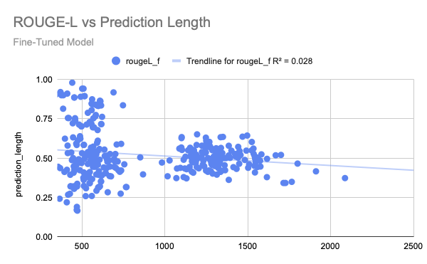

# llama2-qlora-finetune
Implementation of a task-specific **QLoRA supervised fine-tuning** pipeline for **LLaMA-2-7B-Chat**, developed for an independent study on structured cover letter generation.

## Table of Contents
- [Project Context](#project-context)
- [Model Access](#model-access)
- [Model Choice](#model-choice)
- [Getting Started](#getting-started)
- [Training Pipeline](#training-pipeline)
  - [Load Base Model & Configure QLoRA](#load-base-model--configure-qlora)
  - [Dataset Cleaning & Normalization](#dataset-cleaning--normalization)
  - [Prompt Schema Construction](#prompt-schema-construction)
  - [Tokenization & Data Collation](#tokenization--data-collation)
  - [Supervised Fine-Tuning](#supervised-fine-tuning)
- [Evaluation Pipeline](#evaluation-pipeline)
- [Model Performance Summary](#model-performance-summary)
  - [Quantitative Analysis](#quantitative-analysis)
  - [Qualitative Analysis](#qualitative-analysis)
- [Dataset Challenges & Limitations](#dataset-challenges--limitations)
- [Results Summary](#results-summary)
- [Future Work](#future-work)
- [Conclusion](#conclusion)

## Project Context
This repository contains the code and experiments from my Independent Study at Baruch College (Fall 2025) in collaboration with the Machine Learning & Data Science Club and Math Department.
The goal was to fine-tune a model for structured cover letter generation, intended for integration into a Chrome extension.

The code in this repository documents the full experimentation pipeline, including:
- dataset analysis and cleaning
- prompt schema design
- QLoRA/LoRA configuration
- supervised fine-tuning
- evaluation and comparison with the base model

Although this repository is primarily a research record, all code is fully open and can be adapted or reused for your own fine-tuning experiments.
Feel free to explore, modify, or extend the pipeline as needed!

## Model Access
The fine-tuned LoRA adapters are available on Hugging Face:

[](https://huggingface.co/czszt/llama2-7b-qlora-cover-letter)

## Model Choice
**LLaMA-2-7B Chat** was selected as the base model for various reasons.
A major consideration was balancing memory usage, training stability, and generation quality.
The 7B parameter size sits in an ideal middle ground:
* Large enough to produce coherent, professional writing suitable for cover letters
* Small enough to fine-tune efficiently using QLoRA on limited hardware

Since the goal here is to improve a base model's performance on generating cover letters, an important consideration
is that the model selected should not already be so good at the task that fine-tuning provides no real benefit. 
**LLaMA-2-7B Chat** is a strong general-purpose instruction-following model, 
but it is not specialized for structured, multi-field cover letter generation. Out of the box, it tends to:
* produce generic, template-like responses
* miss important details from the job description or resume
* improvise qualifications that were never provided
* hallucinate experiences or rewrite the applicant's background incorrectly
* ignore or partially use key fields (skills, past experience, required qualifications)

These weaknesses make it an excellent candidate for fine-tuning.
The chat model was chosen because instruction-tuned models handle structured prompts more reliably, which is important for the task of generating a cover letter
from a resume and job description.

## Getting Started
Install all required Python dependencies using:

```
pip install -r requirements.txt
```

Before running any scripts in this repository, you must update the directory paths.
The training, evaluation, and metrics scripts were written for my own workflow (Kaggle + local machine), so the file locations will not match your environment by default.

Additionally, test.py includes a variable,
```
MERGED_PATH = "where merged model lives"
```
but the model is not merged within this script.

This is intentional: the project was run in separate stages, and the merged model was created externally (on Kaggle) and then pushed to Hugging Face during experimentation.

To reproduce the evaluation pipeline, you must merge the LoRA adapters yourself.

**1. Merging LoRA Adapters**

```train.py``` saves only the LoRA adapter weights, not a full standalone model.
To run evaluation, merge the adapters into the base model using:
```
from transformers import AutoModelForCausalLM, AutoTokenizer
from peft import PeftModel

base_model_name = "meta-llama/Llama-2-7b-chat-hf"
adapter_model_name = "path/to/your/lora_adapter"

# Load base model and tokenizer
tokenizer = AutoTokenizer.from_pretrained(base_model_name)
model = AutoModelForCausalLM.from_pretrained(
    base_model_name,
    device_map="auto",
    torch_dtype=torch.float16
)

# Load and apply LoRA adapters
model = PeftModel.from_pretrained(model, adapter_model_name)

# Merge LoRA weights into the base model
model = model.merge_and_unload()

# Save merged model
model.save_pretrained("merged_model")
tokenizer.save_pretrained("merged_model")
```

Once merged, update
```
MERGED_PATH = "merged_model"
```
in ```test.py```.

### Hardware Requirements
**Tested Setup (what this project actually used)**
* **GPU**: NVIDIA T4
* **VRAM**: 16 GB
* **Training time**: ~1-2 hours for 4 epochs
* **Batch size**: 1
* **Quantization**: 8-bit (NF4 double quantization)

Any GPU with ~16GB VRAM should be sufficient.
Performance and memory usage will vary based on quantization settings and gradient accumulation.

### Environment Setup
**1) Create environment:**

```
conda create -n llama-qlora python=3.10
conda activate llama-qlora
```

**2) Install core dependencies:**
   
```pip install torch transformers datasets accelerate peft bitsandbytes```

**3) Install evaluation dependencies:**
   
```pip install evaluate bert-score rouge-score pandas tqdm```

### Recommended Run Order
train.py → merge LoRA adapters → test.py → clean.py -> metrics.py

The ```scripts/``` directory contains several small utilities.
The scripts/ directory contains several optional utilities used during experimentation.
These are not required to reproduce the main training/evaluation pipeline, except for ```clean.py```.

```clean.py``` is the preprocessing step used in my evaluation pipeline;
if you want to reproduce the results reported in this repository, I recommend running it before computing metrics.

**Helper Scripts**
* ```clean.py``` — Removes the prompt section and outputs only the cover letter text (recommended for evaluation).
* ```filter.py``` — Filters samples based on cover-letter length (optional exploratory tool).
* Other scripts (```compute.py```,```plot.py```) — Useful for analysis but not part of the main pipeline.

Make sure to update all directory paths (model locations, merged model path, and CSV filenames) before running any script.

## Training Pipeline

This project uses a full **Supervised Fine-Tuning (SFT)** workflow with **QLoRA** to adapt **LLaMA-2-7B-Chat** for structured cover-letter generation.
This section describes the complete training workflow.

### Load Base Model & Configure QLoRA
The base model (LLaMA-2-7B-Chat) is loaded in **8-bit NF4** quantization using ```bitsandbytes``` to reduce memory requirements.
A LoRA adapter (rank=8, α=16) is applied to the attention projection layers:

```
target_modules = ["q_proj", "v_proj"]
```

**Why QLoRA?**
* Makes 7B models trainable on a single T4 GPU
* Maintains performance close to FP16
* Only a small number of parameters are updated, improving training stability on a small dataset

### Dataset Cleaning & Normalization
The raw dataset includes noise, inconsistent formatting, and many generic/AI-generated target texts.
A custom cleaning pipeline was implemented to:
* extract valid cover-letter segments
* remove artifacts (e.g., “### Sample”)
* normalize whitespace and punctuation
* append EOS tokens to enforce clean sequence endings
* truncate sequences to a maximum length of 768 tokens

This step significantly reduces hallucinations and improves structural consistency.

### Prompt Schema Construction
Each sample is transformed into a structured prompt with three sections:
1) Job Description
2) Applicant Resume
3) Instruction Block

Example schema:
```text
### Job Description
Job Title: …
Company: …
Preferred Qualifications: …

### Applicant Resume
Name: …
Current Experience: …
Past Experience: …
Skills: …
Qualifications: …

### Cover Letter
Using the information above, write a professional, personalized cover letter.
```

LLaMA-style models are highly sensitive to prompt formatting.
During experimentation, I found that the more structured and consistent the prompt layout, the more reliably the model:
* grounds its outputs in the provided fields
* avoids hallucinating qualifications
* maintains the correct letter format (intro → body → closing)
* handles both short and long-form inputs

Because of this, the final schema was intentionally designed to be rigid and repeatable across all samples.
The model learns best when every example follows the same pattern, so enforcing a strict template significantly improved stability and output quality.

### Tokenization & Data Collation
Prompts and target letters are concatenated into a single causal-LM sequence:
* right padding (standard for LLaMA-2 models)
* EOS tokens appended
* batching handled via DataCollatorForLanguageModeling
* causal masking applied automatically

### Supervised Fine-Tuning
Training configuration:
* **Epochs**: 4
* **Batch size**: 1
* **Gradient accumulation**: 4
* **Precision**: FP16
* **Optimizer**: paged AdamW (32-bit)
* **Quantization**: 8-bit NF4
  
This setup balances GPU memory limits and training stability.

**Why these choices?**
* **4 epochs** — LLaMA-2 models typically converge within 1–3 epochs on instruction-tuning tasks, but LoRA updates only a small subset of parameters. With a relatively small dataset, an additional epoch helps the adapter layers learn the structured prompt format more effectively while still remaining conservative enough to avoid overfitting.
* **Batch size = 1 with gradient accumulation = 4** — This simulates an effective batch size of 4 while fitting the model into a 16GB T4 GPU.
* **8-bit NF4 quantization** — Reduces memory usage enough to train a 7B model on limited hardware with minimal quality degradation. NF4 provides better precision than standard int8 quantization for LLaMA models.
* **FP16 training** — A good trade-off between speed and stability; keeps memory low while avoiding the instability that can occur with full FP32 training.
*  **Paged AdamW** — The optimizer used by QLoRA to efficiently handle quantized weight offloading and reduce VRAM pressure.

After training, the LoRA adapters are merged into the base **LLaMA-2-7B-Chat** model for evaluation and inference. This repository contains **only adapter weights**, so merging must be done externally before running test.py or computing metrics.

## Evaluation Pipeline
The evaluation workflow compares the fine-tuned model against the base **LLaMA-2-7B-Chat model** on the test split of the dataset.
It consists of three stages:

### Generate Predictions
```test.py``` loads:
* the base model (```meta-llama/LLaMA-2-7B-Chat-hf```)
* the merged fine-tuned model
  
Each example in the test set is formatted using the same structured prompt schema used during training.
For every prompt, both models generate a cover letter.

The outputs are saved to ```eval.csv```:
```
prompt | ground_truth | base_output | fine_tuned_output
```

### Clean Outputs (Optional but Recommended)
```clean.py``` removes the prompt section from each row and normalizes text formatting so that metrics are computed only on the generated cover-letter content.

### Compute Metrics
```metrics.py``` computes the following:
* **ROUGE-L** — structural alignment & grounding
* **BERTScore (P/R/F1)** — semantic similarity
* **Repetition Ratio** — proxy for hallucinations / template stability
  
Two output files are produced:
* ```results_per_example.csv``` — per-example metric values
* ```eval_summary.csv``` — aggregated metric means and standard deviations
  
These metrics were used to generate the quantitative results reported in this repository.

## Model Performance Summary

### Quantitative Analysis
**Metrics interpretation.**  
ROUGE-L captures structural overlap and grounding to the reference letter, while BERTScore reflects semantic similarity independent of exact phrasing. Repetition ratio measures redundancy and template-like behavior; lower values indicate more diverse, less repetitive generations. All metrics are computed per example and aggregated across the test set.

**Full Test Set**
| Model        | ROUGE-L (F1) | BERT-P | BERT-R | BERT-F1 | Repetition Ratio |
|--------------|-------------:|-------:|-------:|--------:|-----------------:|
| Base Model   | 0.314        | 0.884  | 0.920  | 0.901   | 0.428 |
| Fine-Tuned   | **0.519**    | **0.927** | **0.939** | **0.933** | **0.361** |


*Mean ROUGE-L F1 and BERTScore (Precision, Recall, and F1) on the full test split for the base and fine-tuned models. Axes are cropped to the range of observed values for readability.*


**Stability & distribution (Full Test Set)**

| Model        | ROUGE-L Std | ROUGE-L Median | BERT-F1 Std | BERT-F1 Median | Repetition Ratio Std |
|--------------|-------------:|---------------:|------------:|---------------:|---------------------:|
| Base Model   | 0.072        | 0.323          | 0.017       | 0.900          | 0.037 |
| Fine-Tuned   | 0.149        | **0.495**      | 0.018       | **0.933**      | 0.075 |

**Relative Improvements (Fine-Tuned vs Base):**
- ROUGE-L: **+65%**
- BERT-F1: **+3.5%**
- Repetition Ratio: **−15.5%**

Overall, the substantially higher median ROUGE-L alongside increased variance indicates that improvements are consistent across most examples rather than driven by a small number of outliers. The higher variance reflects greater flexibility in output length and structure, not instability in model behavior. In particular, evaluation of very short cover letters is challenging: in several cases, the fine-tuned model produces outputs that are qualitatively stronger than the reference text, despite receiving lower overlap-based scores. For this reason, qualitative analysis is emphasized for short-form outputs.

**Effect of output length on ROUGE-L**



The plot reveals a clear difference in variance by length. Short-form outputs (≈300–600 characters) exhibit substantially higher dispersion in ROUGE-L scores, while longer outputs cluster more tightly. This behavior reflects a known limitation of overlap-based metrics: for very short texts, small lexical differences or noisy reference targets can lead to disproportionately high or low scores.

These observations motivate a separate analysis of long-form cover letters (≥500 characters), which better reflect realistic usage and reduce metric instability.


**Long-Form Cover Letters (≥ 500 characters)**

| Model        | ROUGE-L (F1) | BERT-P | BERT-R | BERT-F1 | Repetition Ratio |
|--------------|-------------:|-------:|-------:|--------:|-----------------:|
| Base Model   | 0.355        | 0.904  | 0.919  | 0.911   | 0.429 |
| Fine-Tuned   | **0.507**    | **0.935** | **0.933** | **0.934** | **0.397** |

**Relative Improvements:**
- ROUGE-L: **+43%**
- BERT-F1: **+2.5%**
- Repetition Ratio: **−7.4%**

Because long-form cover letters require sustained structure and grounding, these results provide a more reliable estimate of real-world performance than aggregate metrics alone.

### Qualitative Analysis
####1. Short-Form Cover Letter

**Prompt**
```text
### Job Description
Job Title: AI Engineer
Company: Facebook
Preferred Qualifications: MSc in AI

### Applicant Resume
Name: Eleanor Brown
Current Experience: AI Engineer at Amazon for 3 years
Past Experience: Data Scientist at Microsoft for 4 years
Skills: Python, R, SQL, Machine Learning, Deep Learning, Artificial Intelligence
Qualifications: MSc in AI

### Cover Letter
Using the information above, write a professional, personalized cover letter.
```

<br>

**Base Model Output (LLaMA-2-7B-Chat)**
* Generic template-like phrasing  
* Does not ground itself in the provided résumé fields  
* **States “over 5 years of experience,” ignoring the explicit 3 + 4 years given**  
* Reflects heuristic templating rather than actual reasoning over the inputs
   
```text
Dear Hiring Manager,

I am writing to express my strong interest in the AI Engineer position at Facebook. As an experienced AI Engineer with a passion for developing innovative solutions, I am confident that I would be a valuable addition to your team.

With over 5 years of experience in the field, I have honed my skills in Python, R, SQL, Machine Learning, Deep Learning, and Artificial Intelligence. My most recent role at Amazon has given me the opportunity to work on complex projects, including developing and deploying AI models for customer service and personalization. I have also had the chance to collaborate with cross-functional teams, including data scientists, software engineers, and product managers, to deliver high-impact solutions.

I am particularly drawn to Facebook's commitment to advancing the field of AI and using it to positively impact society. I share this vision and believe that my skills and experience make me well-suited to contribute to this effort. I am excited at the prospect of joining a team of talented professionals who are dedicated to pushing the boundaries of what is possible with AI.

In addition to my technical skills, I possess excellent communication and collaboration skills, which have been essential in working with stakeholders and team members to drive projects forward. I am also a strong problem-solver and have a proven track record of breaking down complex problems into manageable parts and developing creative solutions.

Thank you for considering my application. I would be thrilled to bring my skills and experience to Facebook and contribute to the company's mission of advancing the field of AI.

Sincerely,
Eleanor Brown
```

<br>

**Fine-Tuned Model Output**
* More concise and structured
* Uses input fields accurately
* **Correctly infers 7 years of combined experience (3 + 4)**
* Avoids unnecessary elaboration or hallucination
```text
I am excited to apply for the AI Engineer position at Facebook. I have a Master's degree in AI and have been working in the field for 7 years. I am proficient in Python, R, SQL, and have a deep understanding of machine learning and deep learning algorithms. I am confident that my skills and experience make me a strong candidate for this role. I am looking forward to the opportunity to contribute to Facebook's AI initiatives. Thank you for considering my application.

Sincerely,
Eleanor Brown
```

#### 2. Long-Form Cover Letter ####

**Prompt**
```text
### Job Description
Job Title:  Data Scientist
Company: DataTech Solutions
Preferred Qualifications:   1. Degree in Statistics, Mathematics, Economics, Computer Science, Data Science, or related field.
  2. 2+ years of experience in data or business analytics, preferably in a digital publisher setting.
  3. Working knowledge of SQL and ability to quickly learn internal tools.
  4. Experience with data visualization tools (Tableau, Looker, Power BI, etc.).
  5. Preferred understanding of the online advertising and publishing industry.

### Applicant Resume
Name: John Smith
Current Experience: Data Scientist at DEF Corp
Past Experience: Data Analyst at XYZ Corp, Business Intelligence Intern at ABC Corp
Skills: Hard skills: Data analysis, statistical modeling, SQL, Python, Tableau
Soft skills: Analytical thinking, problem-solving, communication, adaptability
Qualifications: Bachelor's degree in Statistics, 3+ years of experience in data analysis, proficiency in SQL and Python, strong analytical and communication skills.

### Cover Letter
Using the information above, write a professional, personalized cover letter.
```
<br>

**Base Model Output (LLaMA-2-7B-Chat)**
* Generic phrasing (“I am excited to apply…”)
* Minimal use of job-specific details
* Skill mentions are correct but shallow and not tied to responsibilities
```text
Dear Hiring Manager,

I am excited to apply for the Data Scientist position at DataTech Solutions. As a passionate data analyst with 3+ years of experience in the field, I am confident in my ability to contribute to your team's success.

My current role at DEF Corp has provided me with extensive experience in data analysis, statistical modeling, and SQL. I have a strong understanding of data visualization tools such as Tableau and have used Python to develop predictive models. I am also skilled in communication and problem-solving, having worked with cross-functional teams to present insights and drive business decisions.

I am particularly drawn to DataTech Solutions' focus on leveraging data to drive business growth. I believe that my analytical thinking and problem-solving skills, combined with my proficiency in SQL and Python, make me a strong fit for this role. I am excited about the opportunity to work with a team of talented data scientists and contribute to the company's success.

Thank you for considering my application. I look forward to discussing my qualifications further.

Sincerely,
John Smith
```

<br>

**Fine-Tuned Model Output**
* Incorporates concrete resume details (large datasets, dashboards, reports)
* References job-required tools (SQL, Python, Tableau)
* Stronger narrative of applicant/job fit
```text
Dear Hiring Manager,

I am writing to express my interest in the Data Scientist position at DataTech Solutions. With a strong background in data analysis and a passion for leveraging data to drive insights, I believe I would be a valuable asset to your team.

In my current role as a Data Scientist at DEF Corp, I have successfully analyzed and interpreted large datasets to identify trends and opportunities for growth. I have also developed and maintained dashboards and reports to effectively communicate findings to stakeholders. My proficiency in SQL, Python, and Tableau allows me to efficiently analyze and visualize data, while my strong analytical and problem-solving skills enable me to tackle complex challenges with ease.

I am particularly impressed by DataTech Solutions' commitment to diversity and inclusion, as well as its focus on creating a positive work environment. I am confident that my skills and qualifications align with the requirements of the role, and I am excited about the opportunity to contribute to your team's success.

Thank you for considering my application. I look forward to the possibility of discussing how my skills and experience can benefit DataTech Solutions.

Sincerely,
John Smith
```

## Dataset Challenges & Limitations
Many target examples (~10.2%) in the dataset are low-quality and appear to be AI-generated.
These samples provide weak supervision because they fail to model the structure or grounding required for a personalized cover letter.

**Input Fields (Job + Resume):**
```text
Job Title: Machine Learning Engineer
Company: IBM
Preferred Qualifications: PhD in Computer Science

Applicant Name: Oliver Lewis
Past Experience: Software Engineer at Facebook
Current Experience: Machine Learning Engineer at Google
Skills: Python, Tensorflow, Keras, Machine Learning
Qualifications: PhD in Computer Science
```

**Cover Letter:**
```text
"I am a skilled Machine Learning Engineer with a PhD in Computer Science. 
have previous experience as a Software Engineer at Facebook and am currently working at Google.
My skillset includes Python, Tensorflow, Keras, and machine learning.
I am excited about this opportunity and believe I would be a great fit for your team."
```
This supervision example is problematic for several reasons.

1. The target text is generic and ungrounded
It does not reference:
* job-specific requirements
* role expectations

2. It lacks structural consistency.
This is a paragraph, not a cover letter. There is no:
* introduction
* conclusion

Beyond low-quality target texts, several samples include incorrectly formatted input fields.  
A common problem is the collapse of multi-line or bullet-list job qualifications into a single unstructured line.  
For example, this is an actual entry for the “Preferred Qualifications” field:
```text
experience mentoring other analysts excellent written communication skills excellent sql skills experience with data visualization tools (e.g. looker, tableau, periscope) 5+ years working in an analytics team at a highgrowth company
```

Unfortunately, not many cover letter datasets exist publicly, making this one of the only options despite its various issues.

## Results Summary

Overall, the fine-tuned model demonstrates:

* Substantial improvements in structural alignment (≈65% relative ROUGE-L gain on the full test set)
* Consistent gains in semantic similarity, as measured by BERTScore, across all outputs
* Reduced repetition and template-driven generation
* Stable and reliable improvements on long-form, realistic cover letters (≈43% relative ROUGE-L gain for outputs ≥500 characters)

## Future Work
Several directions could meaningfully improve the model’s performance and stability:

**1. Higher-Quality Training Data**  
The largest bottleneck is noisy supervision. A curated or human-edited dataset would likely improve grounding, reduce hallucinations, and produce more consistent formatting.

**2. Expand Model Size or Architecture**  
Fine-tuning LLaMA-2-13B or LLaMA-3-8B may improve fluency, coherence, and long-form structure, especially for complex job descriptions.

**3. Classifier-Assisted Data Filtering**  
A lightweight classifier could be trained to identify well-structured, grounded cover-letter examples.  
Using this alongside the generator—either to filter training data or score model outputs—could significantly improve consistency without requiring large-scale alignment pipelines.

## Conclusion
This project demonstrates that **parameter-efficient fine-tuning (QLoRA)** can meaningfully improve **LLaMA-2-7B-Chat's** performance on a structured generation task—even under severe hardware and dataset constraints.

Despite noisy supervision and limited training data, the fine-tuned model:
* produces more grounded cover letters
* uses job and resume fields more accurately
* maintains a consistent format
* reduces hallucinations and repetition
  
There is still room for improvement through:
* higher-quality or human-curated datasets
* additional structural constraints during training
* larger models (LLaMA-2-13B or LLaMA-3 variants)
  
This repository serves both as a full experimentation record and as a reproducible template for training specialized QLoRA models on modest hardware.
